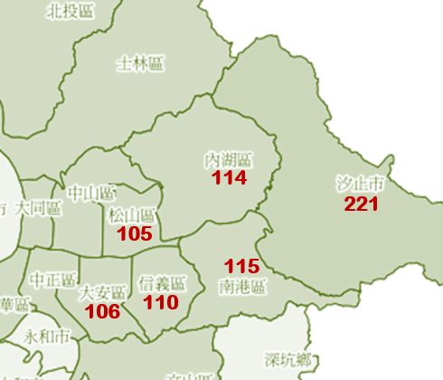

<br>
```{r echo=T, message=F, cache=F, warning=F}
rm(list=ls(all=TRUE))
pacman::p_load(Matrix, vcd, magrittr, readr, caTools, ggplot2, dplyr)
load("data/tf0.rdata")
sapply(list(cust=A0,tid=X0,items=Z0), nrow)
```
<br>

### 年齡與地理區隔
```{r fig.height=2, fig.width=7}
par(mfrow=c(1,2),cex=0.7)
table(A0$age) %>% barplot(las=2,main="Age Groups")
table(A0$area) %>% barplot(las=2,main="Areas")
```

+ 由上圖可知，年齡層落在30到34歲和35到39歲的顧客相對較多，且居住在南港區和汐止市的顧客相對較多。



<br>

##### 年齡與地理區隔的關聯性
使用馬賽克圖檢視列連表的關聯性(Association between Categorial Variables)

+ 方塊大小代表該類別組合的數量
+ 紅(藍)色代表該類別組合的數量顯著小(大)於期望值
+ 期望值就是邊際機率(如上方的直條圖所示)的乘積
+ 卡方檢定(類別變數的關聯性檢定)的p值顯示在圖示最下方
+ `p-value < 2.22e-16` : `age` 與 `area` 之間有顯著的關聯性


```{r fig.height=5, fig.width=6}
MOSA = function(formula, data) mosaic(formula, data, shade=T, 
  margins=c(0,1,0,0), labeling_args = list(rot_labels=c(90,0,0,0)),
  gp_labels=gpar(fontsize=9), legend_args=list(fontsize=9),
  gp_text=gpar(fontsize=7),labeling=labeling_residuals)
# 每個馬賽克代表人數多寡
# 顏色代表格子內的比率大小
MOSA(~area+age, A0)
```

1. 和全體居住區域相比，居住在南港區的中年族群相對較少，青年和老年族群相對較多。 
2. 和全體居住區域相比，居住在汐止市的青年和中年族群相對較多，老年族群相對較少。 
3. 和全體年齡層相比，年齡層落在30到34歲的族群居住在汐止市和其他區的人相對較多，居住在南港區和未知區域的人相對較少。
4. 和全體年齡層相比，年齡層落在35到39歲的族群居住在內湖區、汐止市和其他區的人相對較多，居住在南港區和未知區域的人相對較少。

---

1. 跟整體族群比例相比，住在Z114的人，中年年人比例比較高，老年人比例比較少。
2. 跟整體族群居住地區相比，a34這年齡族群的人，住在z221和zOther比較多，住在z115的比較少。 
3. 跟整體族群居住地區相比，a69這年齡族群的人，住在z115的最多，在zOther的最少。
4. Z115地區，a34顧客的比率，顯著小於全體顧客的a34比率。
5. A34住在z115的比率，顯著小於全體顧客住在z115的比率。

<br><hr>

### 簡單泡泡圖

##### 年齡區隔特徵
```{r}
A0 %>% group_by(age) %>% summarise(
  Group.Size = n(),              # 族群人數
  avg.Freq = mean(f),            # 平均購買次數
  avg.Revenue = sum(f*m)/sum(f)  # 平均客單價
  ) %>% 
  ggplot(aes(y=avg.Freq, x=avg.Revenue)) +
  geom_point(aes(col=age, size=Group.Size), alpha=0.5) +
  geom_text(aes(label=age)) +
  scale_size(range=c(5,25)) +
  theme_bw() + theme(legend.position="none") +
  ggtitle("年齡區隔特徵 (泡泡大小:族群人數)") + 
  ylab("平均購買次數") + xlab("平均客單價")
```

```{r}
mean(A0$age == "a99")
```

由於`a99`(沒有年齡資料的顧客)人數不多，而且特徵很獨特，探索時我們可以考慮濾掉這群顧客
```{r}
A0 %>% filter(age!="a99") %>%    # 濾掉沒有年齡資料的顧客('a99')
  group_by(age) %>% summarise(
  Group.Size = n(),              # 族群人數
  avg.Freq = mean(f),            # 平均購買次數
  avg.Revenue = sum(f*m)/sum(f)  # 平均客單價
  ) %>% 
  ggplot(aes(y=avg.Freq, x=avg.Revenue)) +
  geom_point(aes(col=age, size=Group.Size), alpha=0.5) +
  geom_text(aes(label=age)) +
  scale_size(range=c(5,25)) +
  theme_bw() + theme(legend.position="none") +
  ggtitle("年齡區隔特徵 (泡泡大小:族群人數)") + 
  ylab("平均購買次數") + xlab("平均客單價")
```

1. a69族群平均客單價最低，但平均購買次數最多，應屬於潛力顧客。
2. a39和a44族群平均購買次數偏低，但平均客單價很高，應屬於主力顧客。 
3. a24族群平均購買次數較低，且平均客單價也很低，應屬於沉睡顧客。

---

1. 由於a99(沒有年齡資料的顧客)人數不多，而且特徵很獨特，探索時我們可以考慮濾掉這群顧客。 
2. A34、a39、a44的不常消費，但每次消費金額較高，其中以a44金額最高。
3. Finding :「年齡」與「地區」之間有很高的關聯性。 
4. 策略：讓a34的消費頻率提高。 ##### 地理區隔特徵

##### 地理區隔特徵
```{r}
A0 %>% filter(age!="a99") %>%    # 濾掉沒有年齡資料的顧客('a99')
  group_by(area) %>% summarise(
  Group.Size = n(),              # 族群人數
  avg.Freq = mean(f),            # 平均購買次數
  avg.Revenue = sum(f*m)/sum(f)  # 平均客單價
  ) %>% 
  ggplot(aes(y=avg.Freq, x=avg.Revenue)) +
  geom_point(aes(col=area, size=Group.Size), alpha=0.5) +
  geom_text(aes(label=area)) +
  scale_size(range=c(5,25)) +
  theme_bw() + theme(legend.position="none") +
  ggtitle("地理區隔特徵 (泡泡大小:族群人數)") + 
  ylab("平均購買次數") + xlab("平均客單價")
```

1. z115族群平均客單價最低，但平均購買次數最多，應屬於潛力顧客。 
2. z106族群平均購買次數偏低，但平均客單價很高，應屬於主力顧客。 
3. z114、z105和z110族群平均購買次數很低，但平均客單價相對較高，應屬於瞌睡顧客。

---

1. 住在z115 和z221的族群消費頻率較高且人數亦多，其中又以z115最高，但和整題其他族群比較，平均消費的金額偏低。 
2. 「平均購買次數」和「平均客單價」之間有明顯的負相關。

<p class="wwl">
<span style="font-size:20px">`r "\U1F4A1"` 主要發現：</span><br>
※ 「年齡」與「地區」之間有很高的關聯性<br>
&emsp; &emsp; § 南港(`z115`)30~40歲的顧客比率比較低<br>
&emsp; &emsp; § 汐止(`z221`)、內湖(`z114`)和其他(`zOthers`)30~40歲的顧客比率比較高<br>
※ 「平均購買次數」和「平均客單價」之間有明顯的負相關<br>
&emsp; &emsp; § 住的遠(近)的人比較少(常)來買、但每一次買的比較多(少)<br>
&emsp; &emsp; § 30~40歲(年輕和年長)的人比較少(常)來買、但每一次買的比較多(少)<br>
</p class="wwl"><br><hr>


### 產品資訊
```{r}
cats = Z0 %>% group_by(cat) %>% summarise(
  noProd = n_distinct(prod),
  totalQty = sum(qty),
  totalRev = sum(price),
  totalGross = sum(price) - sum(cost),
  grossMargin = totalGross/totalRev,
  avgPrice = totalRev/totalQty
  )
```

##### 品類的營收和毛利貢獻
```{r fig.height=4, fig.width=6}
par(mfrow=c(2,1), cex=0.7)
cats$totalRev %>% sort(dec=T) %>% {cumsum(.)[1:40]/sum(.)} %>% 
  barplot(names=1:40,las=2,main="acc. percentage of reveune")
abline(h=seq(0,1,0.1),col='green')

cats$totalRev %>% sort(dec=T) %>% {cumsum(.)[1:40]/sum(.)} %>% 
  barplot(names=1:40,las=2,main="acc. percentage of gross profit")
abline(h=seq(0,1,0.1),col='green')

```

**品類的營收和毛利貢獻相當分散**

+ 營收最大的10個品類只貢獻~20%的營收
+ 毛利最大的10個品類只貢獻~20%的毛利

<br>

##### 品類和年齡、地區的關聯性
```{r}
top20 = tapply(Z0$qty,Z0$cat,sum) %>% sort %>% tail(20) %>% names
```

```{r fig.height=6, fig.width=8}
MOSA(~cat+age, Z0[Z0$cat %in% top20,])
```

1. 和全體品類相比，購買130106品類商品的青年族群相對較少，中年和老年族群相對較多。 
2. 和全體品類相比，購買110411品類商品的青年族群相對較多，老年族群相對較少。 
3. 和全體年齡層相比，30到34歲族群購買560201品類商品的人相對較多，但購買130106品類商品的人相對較少。 4.和全體年齡層相比，40到44歲族群購買100102品類商品的人相對較多，但購買560201品類商品的人相對較少。

---

1. 跟所有年齡層的族群相比，購買110401最多的事a34這年齡的族群。

```{r fig.height=6, fig.width=8}
MOSA(~cat+area, Z0[Z0$cat %in% top20,])
```

**不同年齡、地區的顧客喜歡買的品類看來也不太一樣**

1. 和全體品類相比，購買130106品類商品的人當中，居住在南港區和汐止市的人相對較多，其他地區的人則相對較少。 
2. 和全體品類相比，購買110411品類商品的人當中，居住在南港區的人相對較少，信義區、其他地區和未知區域的人則相對較多。 
3. 和全體居住區域相比，居住在南港區的人當中，購買120103品類商品的人相對較多，但購買110402品類商品的人相對較少。 
4. 和全體居住區域相比，居住在汐止市的人當中，購買110402品類商品的人相對較多，但購買500210品類商品的人相對較少。

---

1. 跟其他品類相比，z115地區的族群，購買130204最多。 
2. 500201在z110這區的銷量最好。

<br><hr>


### 周末與周間
```{r fig.height=2, fig.width=6}
X0$wday = format(X0$date, "%u")
par(cex=0.7, mar=c(2,3,2,1))
table(X0$wday) %>% barplot(main="No. Transactions in Week Days")
```

1. 和其他購物日相比，在星期五購物的人當中，年輕族群相對較少，老年族群相對較多。 
2. 和其他購物日相比，在星期一購物的人當中，年輕族群相對較多。 
3. 和全體年齡層相比，30到34歲族群在星期日購物的人相對較多，但在星期二、四、五購物的人相對較少。 
4. 和全體年齡層相比，35到39歲族群在星期日購物的人相對較多，但在星期二、三購物的人相對較少。

---

1. 跟所有日期相比，星期天購物的顧客在a34和a39是比較多的，年老的顧客較少。 
2. 年老的年齡層在週一到五的消費頻率較高。 3.一週間，a99的年齡層最常在星期二消費。

##### 年齡與購物日的關聯性
```{r fig.height=4, fig.width=5}
MOSA(~wday+age, X0)
```

```{r fig.height=6, fig.width=8}
df = Z0 %>% filter(cat %in% top20) %>% mutate(wday = format(date, '%u'))
MOSA(~cat+wday, df)
```

1. 和全體品類相比，購買130106品類商品的人當中，在星期一、二購買的人相對較多，在星期日購買的人則相對較少。 
2. 和全體品類相比，購買110411品類商品的人當中，在星期四、日購買的人相對較多，在星期二、三購買的人則相對較少。 
3. 和其他購物日相比，在星期二購物的人當中，購買110106品類商品的人相對較多，但購買120103品類商品的人相對較少。 
4. 和其他購物日相比，在星期六購物的人當中，購買120103品類商品的人相對較多，但購買130315品類商品的人相對較少。

---

1. 星期日530701這品類賣得最好。 
2. 110106在星期二銷量最佳，星期日銷量最差（主要購買者為高齡族群）。

<br><hr>


