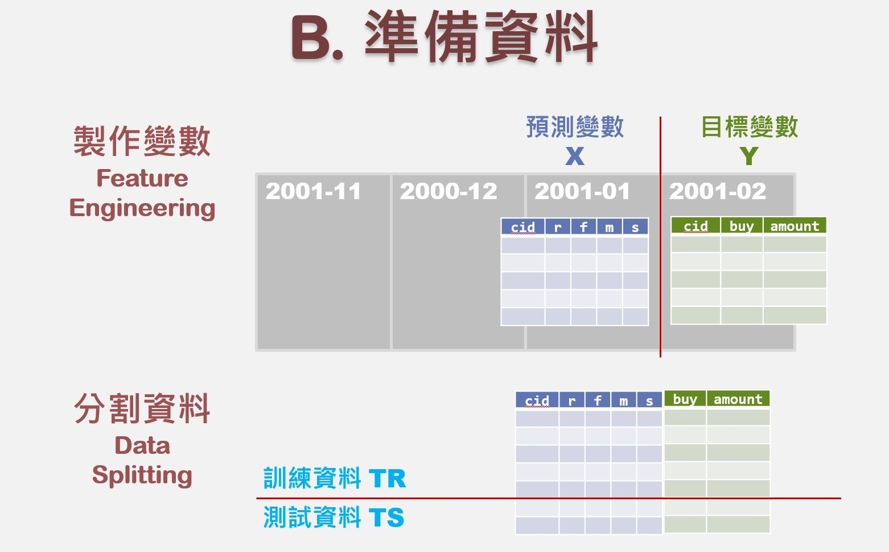

<br>

### 資料準備流程

<center>



</center>

<hr>

### Preparing The Predictors (X)
```{r echo=T, message=F, cache=F, warning=F}
rm(list=ls(all=TRUE))
pacman::p_load(magrittr, caTools, ggplot2, dplyr)
load("data/tf0.rdata")
```

##### The Demarcation Date
Remove data after the demarcation date
```{r}
# 分割出2001-02-01日期之前的資料
feb01 = as.Date("2001-02-01") 
Z = subset(Z0, date < feb01)    # 618212
```

##### Aggregate for the Transaction Records
```{r}
#將每一筆交易資料群組，加總交易產品數量、交易金額、計算毛利
X = group_by(Z, tid) %>% summarise(
  date = first(date),  # 交易日期
  cust = first(cust),  # 顧客 ID
  age = first(age),    # 顧客 年齡級別
  area = first(area),  # 顧客 居住區別
  items = n(),                # 交易項目(總)數
  pieces = sum(qty),          # 產品(總)件數
  total = sum(price),         # 交易(總)金額
  gross = sum(price - cost)   # 毛利
  ) %>% data.frame  # 88387
```

```{r}
summary(X)
```

##### Check Quantile and Remove Outlier 
```{r}
# 找出outlier
sapply(X[,6:9], quantile, prob=c(.999, .9995, .9999))
```

```{r}
X = subset(X, items<=64 & pieces<=98 & total<=11260) # 88387 -> 88295
```

##### Aggregate for Customer Records
```{r}
# 進行RSFM顧客分群，先計算每位顧客交易資料的RSFM值
d0 = max(X$date) + 1
A = X %>% mutate(
  days = as.integer(difftime(d0, date, units="days"))
  ) %>% 
  group_by(cust) %>% summarise(
    r = min(days),      # recency
    s = max(days),      # seniority
    f = n(),            # frquency
    m = mean(total),    # monetary
    rev = sum(total),   # total revenue contribution
    raw = sum(gross),   # total gross profit contribution
    age = age[1],       # age group
    area = area[1],     # area code
  ) %>% data.frame      # 28584
nrow(A)
```
<br><br><hr>

### Preparing the Target Variables (Y)

##### Aggregate Feb's Transaction by Customer
```{r}
# 分割建模型用的預測資料
# 分割出2001-02-01日期之後的資料，並計算每位顧客的交易總金額
feb = filter(X0, date>= feb01) %>% group_by(cust) %>% 
  summarise(amount = sum(total))  # 16900
```

##### The Target for Regression - `A$amount`
Simply a Left Joint
```{r}
# 透過left join 將交易總金額合併，回歸分析使用
A = merge(A, feb, by="cust", all.x=T) 
# 將feb資料匡的紀錄併入A並將沒有的資料填入NA
# NA即代表2月份沒有來購物的消費者
```

##### The Ta
rget for Classification - `A$buy`
```{r}
A$buy = !is.na(A$amount) #檢查時否還有NA，不是NA = FALSE、是NA = TRUE
table(A$buy, !is.na(A$amount))
```

##### Summary of the Dataset
```{r}
summary(A)
```

##### Train & Test Dataset
```{r}
# 按照日期分割訓練、測試資料集
X = subset(X, cust %in% A$cust & date < as.Date("2001-02-01"))
Z = subset(Z, cust %in% A$cust & date < as.Date("2001-02-01"))
# 設定隨機變數種子，避免區分70%訓練、30%測試的資料集時，沒有隨機抽樣
set.seed(2018); spl = sample.split(A$buy, SplitRatio=0.7)
c(nrow(A), sum(spl), sum(!spl))
```

```{r fig.height=3, fig.width=7}

cbind(A, spl) %>% filter(buy) %>% # 將有購買的資料挑選出來
  ggplot(aes(x=log(amount))) + geom_density(aes(fill=spl), alpha=0.5)
# 將TR和TS的顧客購買金額分佈繪製在density上
# TRUE = TR, FALSE = TS
# 兩者形狀大致相同，代表分割資料的臨界點選擇是正確的
```

```{r}
# 分割出目標資料
# 將A裡面有購買記錄的人挑出來，與錢相關的欄位取log
A2 = subset(A, buy) %>% mutate_at(c("m","rev","amount"), log10)
n = nrow(A2)
set.seed(2018); spl2 = 1:n %in% sample(1:n, round(0.7*n))# 將向量隨機抽樣並切成7:3
c(nrow(A2), sum(spl2), sum(!spl2))
```

```{r fig.height=3, fig.width=7}
# 一樣畫圖驗證7:3 資料集是否有隨機抽樣成常態分布
cbind(A2, spl2) %>% 
  ggplot(aes(x=amount)) + geom_density(aes(fill=spl2), alpha=0.5)
```


```{r}
# 將分割好的4群資料存檔
save(Z, X, A, spl, spl2, file="data/tf3.rdata")
```
<br>

> 心得：
「分群分得好，預測沒煩惱」
分群是一連串嚴謹的步驟，將預測＆目標資料分群
並添增購買總金額與是否有購買的驗證資料欄位
再用比例（7:3）去分出訓練＆測試資料
讓後續建模型的時候，可以使用很準確的資料去建模、驗證、預測
也讓最終預測的辨識率和正確率更高。


<center>


</center>


<br><hr>

