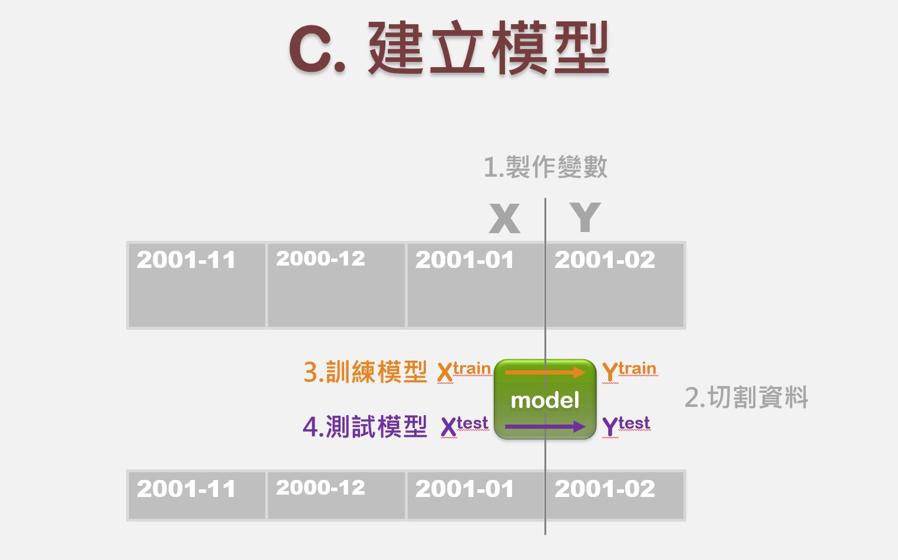
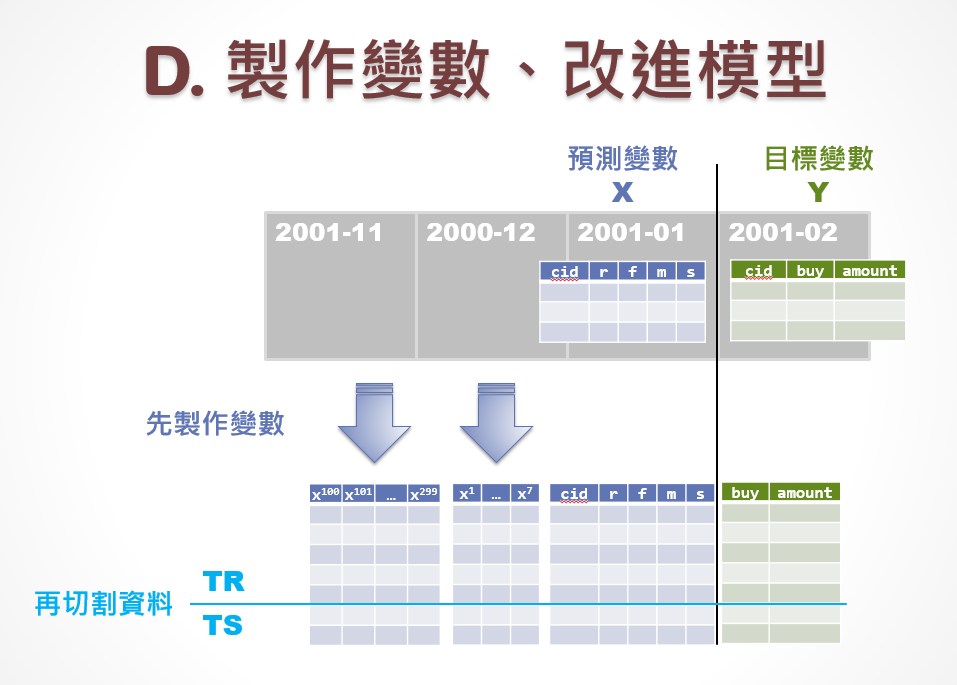
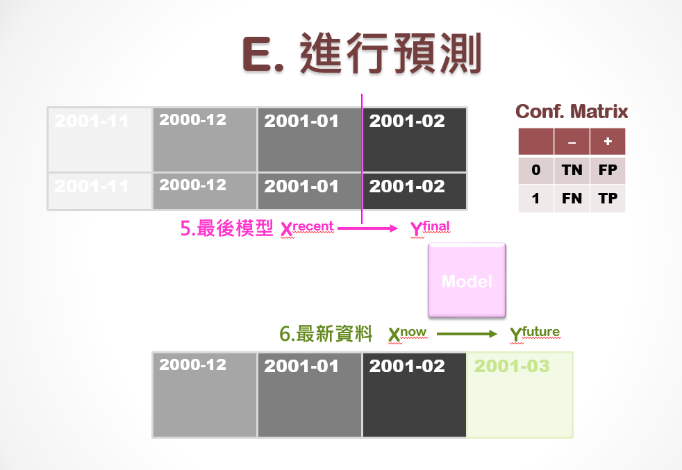

### 模型訓練與測試流程

<center>


</center>

<hr>

### Loading & Preparing Data
```{r echo=T, message=F, cache=F, warning=F}
pacman::p_load(dplyr,ggplot2,caTools)
rm(list=ls(all=TRUE))
Sys.setlocale("LC_TIME","C")
load("data/tf3.rdata")
```

##### Spliting for Classification 
```{r}
#分出訓練資料跟測試資料。
TR = subset(A, spl) 
TS = subset(A, !spl)
```
<br><hr>

### Classification Model
```{r}
#製作線性迴歸模型
#為什麼要跳過第一、第十個欄位？因為不能拿cust、amount來做，他們是y的函數。
#glm代表線性回歸的function
glm1 = glm(buy ~ ., TR[,c(2:9, 11)], family=binomial()) 
summary(glm1)
```

```{r}
#confusion matrix
#進行資料的測試
pred =  predict(glm1, TS, type="response")
cm = table(actual = TS$buy, predict = pred > 0.5); cm
```

```{r}
#acc.ts是要算出準確率，下列演算式的逗點就代表cm，把對角線加起來做分子(diag)，整個矩陣(sum)加起來做分母。
acc.ts = cm %>% {sum(diag(.))/sum(.)}
#1-mean(TS$buy)是不買的機率，是null-model，所以大概0.53的人不買，0.47的人會買，而我們會猜大的一方，所以頂多猜中0.53比率。
#用這個模型去預測，可以猜中大概0.7比率（更高）。
c(1-mean(TS$buy) , acc.ts)  # 0.69998
```

```{r}
#此AUC算是偏低，原因是資料筆數不夠，否則可以更高。
colAUC(pred, TS$buy)        # 0.7556
```
<br><hr>

### Regression Model
```{r}
#把跟金錢相關的類別mutate起來
A2 = subset(A, A$buy) %>% mutate_at(c("m","rev","amount"), log10)
TR2 = subset(A2, spl2)
TS2 = subset(A2, !spl2)
```

```{r}
#用lm function做回歸
lm1 = lm(amount ~ ., TR2[,c(2:6,8:10)])
summary(lm1)
```

```{r}
#兩者做出的R square差不多，代表兩者對模型解釋程度相近。
r2.tr = summary(lm1)$r.sq
SST = sum((TS2$amount - mean(TR2$amount))^ 2)
SSE = sum((predict(lm1, TS2) -  TS2$amount)^2)
r2.ts = 1 - (SSE/SST)
c(R2train=r2.tr, R2test=r2.ts)
```
<br><hr>

### 製作變數、改進模型

<center>



</center>


### 進行預測

<center>


</center>

<hr>

Aggregate data 2000-12-01 ~ 2001~02-28. 
```{r}
#指定做2000-12-01 ~ 2001~02-28此段時間的資料集
load("data/tf0.rdata")
d0 = max(X0$date) + 1
B = X0 %>% 
  filter(date >= as.Date("2000-12-01")) %>% 
  mutate(days = as.integer(difftime(d0, date, units="days"))) %>% 
  group_by(cust) %>% summarise(
    r = min(days),      # recency
    s = max(days),      # seniority
    f = n(),            # frquency
    m = mean(total),    # monetary
    rev = sum(total),   # total revenue contribution
    raw = sum(gross),   # total gross profit contribution
    age = age[1],       # age group
    area = area[1],     # area code
  ) %>% data.frame      # 28584
nrow(B)
```

In `B`, there is a record for each customer. `B$Buy` is the probability of buying in March.
```{r}
#用B的資料和glm模型去預測三月的購買機率。
B$Buy = predict(glm1, B, type="response")
```

<span style="font-size:24px">`r "\U1F4A1"`：</span>
預測購買金額時要記得做指數、對數轉換！

```{r}
#因為其前面有取log，所以這邊要進行指對數轉換。
B2 = B %>% mutate_at(c("m","rev"), log10)
B$Rev = 10^predict(lm1, B2)
```

```{r fig.height=2.4, fig.width=7.2}
#畫出Buy之機率與購買頻率的圖表。Ex.預測購買機率為0.3左右的顧客，其購買頻率最高。
par(mfrow=c(1,2), cex=0.8)
hist(B$Buy)
#畫出營收取log之後的數值與購買頻率的圖表。Ex.營收取log之後數值為3左右的值，其被購買頻率最高。
hist(log(B$Rev,10))
```

```{r}
save(B, file='data/tf4.rdata')
```

<br><br><hr>

