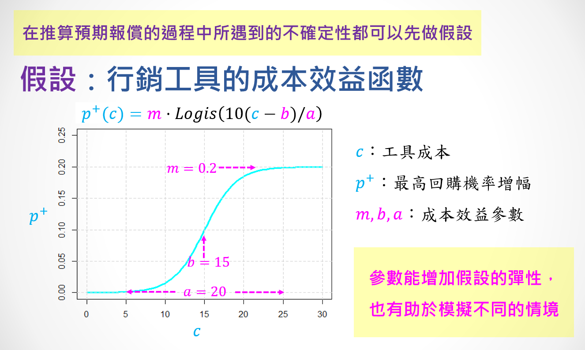

##### Loading & Preparing Data
```{r echo=T, message=F, cache=F, warning=F}
options(scipen=10)
pacman::p_load(latex2exp,Matrix,dplyr,tidyr,ggplot2,caTools)
rm(list=ls(all=TRUE))
load("data/tf4.rdata")
```

##### 購買機率與預期營收的分布
```{r fig.height=2.4, fig.width=7.2}
par(mfrow=c(1,2), cex=0.8)
hist(B$Buy)
hist(log(B$Rev,10))
```

##### 帶有「參數」的成本效益函數



```{r fig.height=2.2, fig.width=7}
DP = function(x,m0,b0,a0) {m0*plogis((10/a0)*(x-b0))}

par(mar=c(4,4,2,1),mfrow=c(1,2),cex=0.7)
# 用curve指令函數設定m, b, a
curve(DP(x,m=0.20,b=15,a=20), 0, 30, lwd=2, ylim=c(0, 0.25),
      main="F( x | m=0.2, b=15, a=20 )", ylab="delta P")
abline(h=seq(0,0.2,0.05),v=seq(0,30,5),col='lightgrey',lty=2)

m=0.1; b=150; a=200; x=200
dp = DP(x,m,b,a)
dp = ifelse(B$Buy+dp>1, 1-B$Buy, dp)
eR = dp*B$Rev - x
hist(eR)
```

$$\Delta P = f(x|m,b,a) = m \cdot Logis(\frac{10(x - b)}{a})$$

$$\hat{R}(x) = \left\{\begin{matrix}
\Delta P \cdot M - x & , & P + \Delta P \leq 1\\ 
(1-P) \cdot M - x & , & else 
\end{matrix}\right.$$


##### 市場模擬：單一參數組合
```{r}
m=0.1; b=50; a=100; X = seq(10,120,1)
sapply(X, function(x) {
  dp = DP(x,m,b,a)
  dp = ifelse(B$Buy+dp>1, 1-B$Buy, dp)
  eR = dp*B$Rev - x*(B$Buy+dp)  ###改成折價卷的寫法，x變成x*(B$Buy+dp)
  c(x=x, eReturn=sum(eR), N=sum(eR > 0), eReturn2=sum(eR[eR > 0]))
  }) %>% t %>% data.frame %>% 
  gather('key','value',-x) %>% 
  ggplot(aes(x=x, y=value, col=key)) + 
  geom_hline(yintercept=0,linetype='dashed') +
  geom_line(size=1.5,alpha=0.5) + 
  facet_wrap(~key,ncol=1,scales='free_y') + theme_bw()
```

##### 不同的參數組合
```{r fig.height=3, fig.width=7}
mm=c(0.2,0.16,0.12,0.08)  ###I1:a24,a29
bb=c(40,50,80,100)        ###I2:a34,a39
aa=c(60,100,150,200)      ###I3:a44,a49
X = seq(0,250,5)          ###I4:a54,a59,a64,a69
do.call(rbind, lapply(1:4, function(i) data.frame(
  Inst=paste0('Inst',i), Para=X, 
  Gain=DP(X,mm[i],bb[i],aa[i])
  ))) %>% data.frame %>% 
  ggplot(aes(x=Para, y=Gain, col=Inst)) +
  geom_line(size=1.5,alpha=0.5) + theme_bw() +
  ggtitle("Prob. Function: f(x|m,b,a)")
```

> 從跑出來的圖可知，因為年輕族群只要給他們相對較小面額的折價券，就可以吸引他們來店消費，而且回購率的提升效果也比較大，所以I1族群(a24,a29)的S曲線上升速度較快，S曲線最高點相較其他族群也最高。隨著顧客年齡層提高，所需發的折價券面額也會越來越高，才能吸引他們來店消費，且回購率的提升效果將隨著年齡層提高而遞減，所以S曲線上升速度:I1 > I2 > I3 > I4；S曲線最高點:I1 > I2 > I3 > I4。

##### 市場模擬：不同的參數組合的比較
```{r fig.height=6, fig.width=6}
X = seq(10, 250, 1) 
df = do.call(rbind, lapply(1:4, function(i) {
  sapply(X, function(x) {
    dp = DP(x,mm[i],bb[i],aa[i])
    dp = ifelse(B$Buy+dp>1, 1-B$Buy, dp)
    eR = dp*B$Rev - x*(B$Buy+dp)###改成折價卷的寫法，x變成x*(B$Buy+dp)
    c(i=i, x=x, eR.ALL=sum(eR), N=sum(eR>0), eR.SEL=sum(eR[eR > 0]) )
    }) %>% t %>% data.frame
  })) 

df %>% gather('key','value',-i,-x) %>% 
  mutate(Instrument = paste0('I',i)) %>% 
  ggplot(aes(x=x, y=value, col=Instrument)) + 
  geom_hline(yintercept=0, linetype='dashed', col='blue') +
  geom_line(size=1.5,alpha=0.5) + 
  xlab('工具選項(成本)') + ylab('預期報償') + 
  ggtitle('行銷工具優化','假設行銷工具的效果是其成本的函數') +
    facet_wrap(~key,ncol=1,scales='free_y') + theme_bw()
```

$$
E(\pi) = g * p * m \\
E(\hat{\pi}) = g * (p+\Delta p) * m(1+\Delta m) \\
E(r) = E(\hat{\pi}) - E(\pi) - x \\ 
\Delta p(x|m_1,b_1,a_1) \; ;\; \Delta m(x|m_2,b_2,a_2)
$$

##### 市場模擬：不同的參數組合的比較 (2)
```{r fig.height=6, fig.width=6}
mm=c(0.2,0.16,0.12,0.08)  ###I1:a24,a29
bb=c(40,50,80,100)        ###I2:a34,a39
aa=c(60,100,150,200)      ###I3:a44,a49
mm2=c(0.2,0.16,0.12,0.08)  ###I1:a24,a29
bb2=c(40,50,80,100)        ###I2:a34,a39
aa2=c(60,100,150,200)      ###I3:a44,a49

gm = 0.15 * 2
X = seq(10, 250, 1) 
df = do.call(rbind, lapply(1:4, function(i) {
  sapply(X, function(x) {
    dp = DP(x,mm[i],bb[i],aa[i])
    dp = ifelse(B$Buy+dp>1, 1-B$Buy, dp)
    dm = DP(x,mm2[i],bb2[i],aa2[i])
    # eR = dp*B$Rev - x*(B$Buy+dp)
    eR = ((B$Buy+dp) * B$Rev*(1+dm) - B$Rev*B$Buy) * gm - x
    
    ###改成折價卷的寫法，x變成x*(B$Buy+dp)
    c(i=i, x=x, eR.ALL=sum(eR), N=sum(eR>0), eR.SEL=sum(eR[eR > 0]) )
    }) %>% t %>% data.frame
  })) 

df %>% gather('key','value',-i,-x) %>% 
  mutate(Instrument = paste0('I',i)) %>% 
  ggplot(aes(x=x, y=value, col=Instrument)) + 
  geom_hline(yintercept=0, linetype='dashed', col='blue') +
  geom_line(size=1.5,alpha=0.5) + 
  xlab('工具選項(成本)') + ylab('預期報償') + 
  ggtitle('行銷工具優化','假設行銷工具的效果是其成本的函數') +
    facet_wrap(~key,ncol=1,scales='free_y') + theme_bw()
```


```{r}
profitRate=0.146
Bu=G5$Buy
Re=G5$Rev
m=0.05; a=20; b=10
cost = 15
increasingRate = DP(cost,m,a,b)
returnTotal = sum(P0*R0*increasingRate*profitRate-cost)
costTotal = length(P0)*cost
data.frame(cost=cost, increasingRate=increasingRate, returnTotal=returnTotal, costTotal=costTotal, ROI=returnTotal/costTotal)
```

**最佳策略(不能選擇行銷對象)**
```{r}
group_by(df, i) %>% top_n(1,eR.ALL)

```

**最佳策略(可以選擇行銷對象)**
```{r}
group_by(df,i) %>% top_n(1,eR.SEL)
```


##### 討論問題
```{r fig.height=1.5, fig.width=5}
par(cex=0.7, mar=c(2,2,1,2))
table(B$age) %>% barplot
```
<br>

<p class="qiz">
<span style="font-size:24px">`r "\U1F5FF"` 討論問題：</span><br>
&emsp; 如果上述4組工具參數分別是某折價券對4個不同年齡族群的效果：<br>
&emsp; &emsp; ■ `I1 : a24, a29`<br>
&emsp; &emsp; ■ `I2 : a34, a39`<br>
&emsp; &emsp; ■ `I3 : a44, a49`<br>
&emsp; &emsp; ■ `I4 : a54, a59, a64, a69`<br>
&emsp; 如果你不能在這4個年齡族群之中選擇行銷對象，你應該如何：<br>
&emsp; &emsp; ■ 設定折價券的面額(`x`)？  <br>
&emsp; &emsp; § 折價券面額應設定為
I1 為 `$62` 、I2為 `$79` 、I3為 `$112` 、I4為 `$10` <br>
&emsp; &emsp; ■ 估計預期報償(`eR.ALL`)？<br>
&emsp; &emsp; § 估計預期報償
I1 為 `$3,601,583` 、I2為 `$2,373,085` 、I3為 `$861,283` 、I4為 `$-365669` <br>
&emsp; 如果你可以在這4個年齡族群之中選擇行銷對象，你應該如何：<br>
&emsp; &emsp; ■ 選擇行銷對象(`N`)？<br>
&emsp; &emsp; § 應選擇I1(a24,a29)族群為行銷對象，N=26905 <br>
&emsp; &emsp; ■ 設定折價券的面額(`x`)？<br>
&emsp; &emsp; § 折價券面額應設定為
I1 為 `$62` 、I2為 `$80` 、I3為 `$118` 、I4為 `$144` <br>
&emsp; &emsp; ■ 估計預期報償(`eR.SEL`)？<br>
&emsp; &emsp; § 估計預期報償為
I1 為 `$3,642,814` 、I2為 `$2,452,381` 、I3為 `$113,9301` 、I4為 `$348,927` <br>
</p class="qiz"><br>


<br><br><hr>

