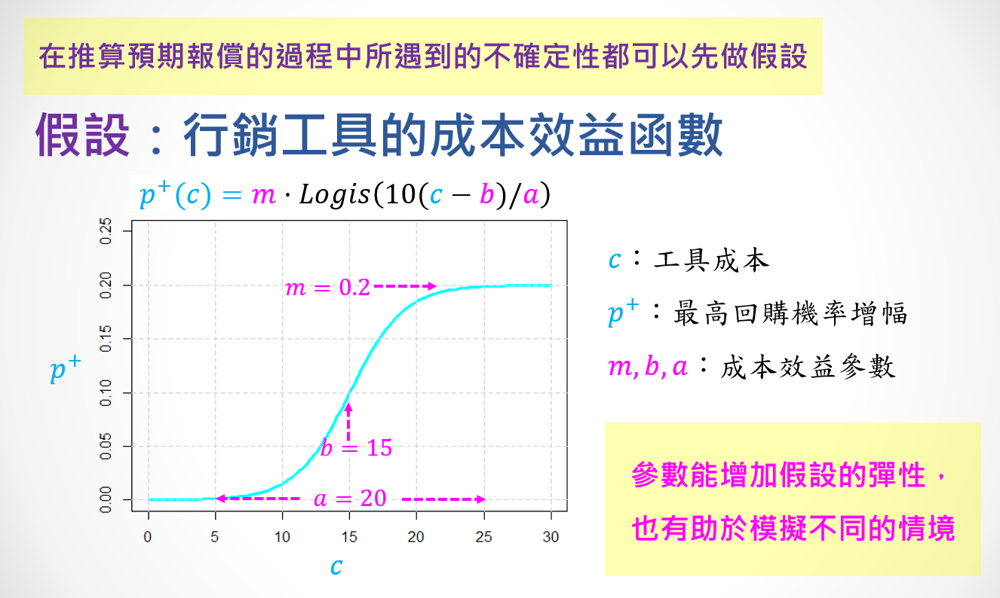

### 前置處理
##### Loading & Preparing Data
```{r echo=T, message=F, cache=F, warning=F}
options(scipen=10)
pacman::p_load(latex2exp,Matrix,dplyr,tidyr,ggplot2,caTools)
rm(list=ls(all=TRUE))
load("data/tf0.rdata")
load("data/tf4.rdata")
```
##### 分群資料
```{r}
set.seed(111)
A0$grp = kmeans(scale(A0[,c(2,4,5)]),6)$cluster
table(A0$grp)
```

##### 購買機率與預期營收的分布
```{r fig.height=2.4, fig.width=7.2}
par(mfrow=c(1,2), cex=0.8)
hist(B$Buy)
hist(log(B$Rev,10))
```

```{r}
B = left_join(B, A0[,c(1,13)]) # 將B與A做join，為了grp轉到B
table(B$grp)
B = B %>% filter(grp != 2) # 排除分群2
B$grp[which(B$grp==6)] <- 2 # 將分群6置換至2
table(B$grp, useNA = "ifany")
```
```{r}
G1 = subset(B, grp=="1") # 流動顧客
G2 = subset(B, grp=="2") # 主力顧客
G3 = subset(B, grp=="3") # 老顧客
G4 = subset(B, grp=="4") # 優質顧客
G5 = subset(B, grp=="5") # 勤儉一族
```

```{r}
B %>% 
  group_by(grp) %>% 
  summarise(
    size = n(),
    AvgBuy = mean(Buy),
    AvgRev = mean(Rev),
    TotalRev = sum(Rev),
)
```

##### 行銷方案
1. 方案目的：提升老顧客購買頻率
2. 目標客群：會員資格需滿90天以上(盡量鎖定是老顧客的會員)才符合領取資格
3. 方案內容：在活動日的消費，依照消費額度，給予下次消費的折扣券且折扣券必須在下次活動日之前使用完畢
4. 方案時間：每季舉辦一次活動日(因為老顧客是超過約89天都沒來消費)


##### 帶有「參數」的成本效益函數



```{r fig.height=2.2, fig.width=7}
DP = function(x,m0,b0,a0) {m0*plogis((10/a0)*(x-b0))}

par(mar=c(4,4,2,1),mfrow=c(1,2),cex=0.7)
# 用curve指令函數設定m, b, a
curve(DP(x,m=0.20,b=15,a=20), 0, 30, lwd=2, ylim=c(0, 0.25),
      main="F( x | m=0.2, b=15, a=20 )", ylab="delta P")
abline(h=seq(0,0.2,0.05),v=seq(0,30,5),col='lightgrey',lty=2)
m=0.1; b=150; a=200; x=200
dp = DP(x,m,b,a)
dp = ifelse(B$Buy+dp>1, 1-B$Buy, dp)
eR = dp*B$Rev - x
hist(eR)
```

$$\Delta P = f(x|m,b,a) = m \cdot Logis(\frac{10(x - b)}{a})$$

$$\hat{R}(x) = \left\{\begin{matrix}
\Delta P \cdot M - x & , & P + \Delta P \leq 1\\ 
(1-P) \cdot M - x & , & else 
\end{matrix}\right.$$


##### 市場模擬：單一參數組合
```{r}
m=0.05; b=50; a=100; X = seq(10,120,1)
sapply(X, function(x) {
  dp = DP(x,m,b,a)
  dp = ifelse(B$Buy+dp>1, 1-B$Buy, dp)
  eR = dp*B$Rev - x  # 改成回購的機率
  c(x=x, eReturn=sum(eR), N=sum(eR > 0), eReturn2=sum(eR[eR > 0]))
  }) %>% t %>% data.frame %>% 
  gather('key','value',-x) %>% 
  ggplot(aes(x=x, y=value, col=key)) + 
  geom_hline(yintercept=0,linetype='dashed') +
  geom_line(size=1.5,alpha=0.5) + 
  facet_wrap(~key,ncol=1,scales='free_y') + theme_bw()
```

##### 不同的參數組合
```{r fig.height=3, fig.width=7}
mm=c(0.1, 0.16, 0.24, 0.08, 0.04, 0.02)   ###I1:流動顧客
bb=c(40, 50, 170, 100, 110, 140 )         ###I2:老顧客
aa=c(60,100,150,200,250,300)              ###I3:優質顧客
X = seq(0,250,5)                          ###I4:勤儉一族
                                          ###I5:主力顧客
do.call(rbind, lapply(1:5, function(i) data.frame(
  Inst=paste0('grp',i), Para=X, 
  Gain=DP(X,mm[i],bb[i],aa[i])
  ))) %>% data.frame %>% 
  ggplot(aes(x=Para, y=Gain, col=Inst)) +
  geom_line(size=1.5,alpha=0.5) + theme_bw() +
  ggtitle("Prob. Function: f(x|m,b,a)")
```

##### 模擬策略
```{r}
m=0.06; a=25; b=20
do.call(rbind, lapply(seq(5,50,0.5), function(x){
  dp = DP(x,m,b,a)
  B %>% mutate(
    dp = ifelse(Buy+dp>1, 1-Buy, dp),
    eR = dp*Rev - x
  ) %>%
    group_by(grp) %>% summarise(
      Cost = x,
      Group.Sz = n(),
      eR.ALL = sum(eR>0),
      eR.SEL = sum(eR[eR>0]),
    ) } ) ) %>% 
  ggplot(aes(x=Cost, y=eR.SEL, col=factor(grp))) +
  geom_line(size=1.2) +
  ggtitle("行銷工具 ")
```
##### 市場模擬：不同的參數組合的比較
```{r fig.height=6, fig.width=6}
X = seq(10, 250, 5) 
df = do.call(rbind, lapply(1:5, function(i) {
  sapply(X, function(x) {
    dp = DP(x,mm[i],bb[i],aa[i])
    dp = ifelse(B$Buy[B$grp==i]+dp>1, 1-B$Buy[B$grp==i], dp)
    eR = dp*B$Rev[B$grp==i] - x # 改成回購的機率
    c(i=i, x=x, eR.ALL=sum(eR), N=sum(eR>0), eR.SEL=sum(eR[eR > 0]) )
    }) %>% t %>% data.frame
  })) 

df %>% gather('key','value',-i,-x) %>% 
  mutate(Instrument = paste0('I',i)) %>% 
  ggplot(aes(x=x, y=value, col=Instrument)) + 
  geom_hline(yintercept=0, linetype='dashed', col='blue') +
  geom_line(size=1.5,alpha=0.5) + 
  xlab('工具選項(成本)') + ylab('預期報償') + 
  ggtitle('行銷工具優化','假設行銷工具的效果是其成本的函數') +
    facet_wrap(~key,ncol=1,scales='free_y') + theme_bw()
```

**最佳策略(不能選擇行銷對象)**
```{r}
group_by(df, i) %>% top_n(1,eR.ALL)

```

**最佳策略(可以選擇行銷對象)**
```{r}
group_by(df,i) %>% top_n(1,eR.SEL)
```


##### 討論問題
```{r fig.height=1.5, fig.width=5}
par(cex=0.7, mar=c(2,2,1,2))
table(B$grp) %>% barplot
```
<br>


<br><br><hr>

