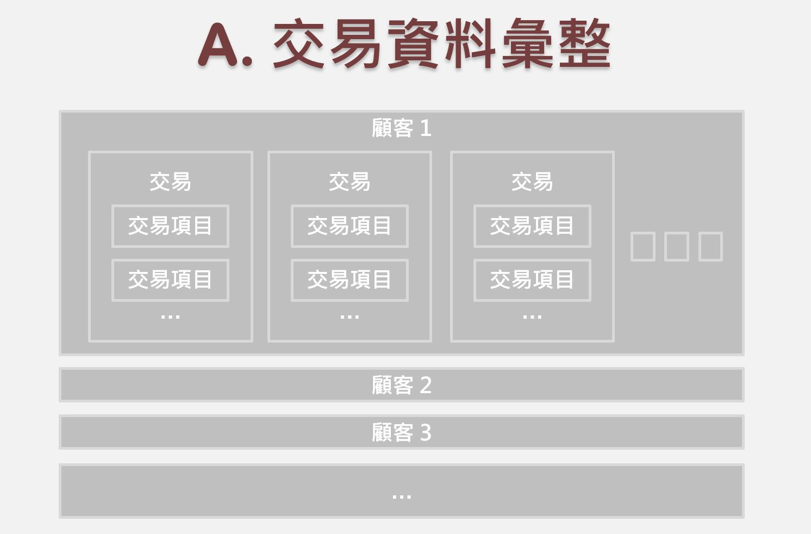

<br>

### 資料彙整流程

<center>



</center>

<hr>

### 1. 交易項目計錄：`Z`

```{r echo=T, message=F, cache=F, warning=F}
rm(list=ls(all=T))
pacman::p_load(magrittr, readr, caTools, ggplot2, dplyr, vcd)
```

##### 1.1 讀進資料
```{r}
Z = read_csv("data/ta_feng_all_months_merged.csv") %>% 
  data.frame %>% setNames(c(
    "date","cust","age","area","cat","prod","qty","cost","price"))
nrow(Z)
```

##### 日期格式轉換
```{r fig.height=3.2, fig.width=7}
Z$date = as.Date(Z$date, format="%m/%d/%Y")
par(cex=0.8)
hist(Z$date,'weeks',freq=T,las=2)
```

##### 年齡層級、郵遞區號
```{r}
age.group = c("<25","25-29","30-34","35-39","40-44",
              "45-49","50-54","55-59","60-64",">65")
Z$age = c(paste0("a",seq(24,69,5)),"a99")[match(Z$age,age.group,11)]
Z$area = paste0("z",Z$area)
```

```{r fig.height=2.5, fig.width=7}
par(mfrow=c(1,2),cex=0.7)
table(Z$age, useNA='ifany') %>% barplot(main="Age Groups", las=2)
table(Z$area,useNA='ifany') %>% barplot(main="Areas", las=2)
```

##### 處理離群值
```{r}
# Quantile of Variables
sapply(Z[,7:9], quantile, prob=c(.99, .999, .9995))
```

```{r}
# Remove Outliers
Z = subset(Z, qty<=24 & cost<=3800 & price<=4000) 
nrow(Z)  
```

##### 彙總訂單 Assign Transaction ID
```{r}
Z$tid = group_indices(Z, date, cust) # same customer same day
```

##### 資料總覽
```{r}
# No. cust, cat, prod, tid
sapply(Z[c("cust","cat","prod","tid")], n_distinct)
```
<br><hr>

### 2. 交易計錄：`X`

##### 交易資料彙整
```{r}
X = Z %>% group_by(tid) %>% summarise(
  date = min(date),          # 交易日期  
  cust = min(cust),          # 顧客 ID
  age = min(age),            # 顧客 年齡級別
  area = min(area),          # 顧客 居住區別
  items = n(),               # 交易項目(總)數
  pieces = sum(qty),         # 產品(總)件數
  total = sum(price),        # 交易(總)金額
  gross = sum(price - cost),  # 毛利
  cat= min(cat)
) %>% data.frame
nrow(X) # 119422 
```

##### 處理離群值
```{r}
# Check Quantile & Remove Outliers
sapply(X[,6:9], quantile, prob=c(.999, .9995, .9999))
```

```{r}
# Remove Outliers
X = subset(X, items<=62 & pieces<95 & total<16000) # 119328
```

##### 交易摘要
```{r}
summary(X)    
```

##### 每周交易次數
```{r fig.height=3, fig.width=7}
par(cex=0.8)
hist(X$date, "weeks", freq=T, las=2, main="No. Transaction per Week")
```
<br><hr>

### 3. 顧客資料：`A`

##### 顧客資料彙整
```{r}
d0 = max(X$date) + 1
A = X %>% mutate(
  days = as.integer(difftime(d0, date, units="days"))
  ) %>% group_by(cust) %>% summarise(
    r = min(days),      # recency
    s = max(days),      # seniority
    f = n(),            # frquency
    m = mean(total),    # monetary
    rev = sum(total),   # total revenue contribution
    raw = sum(gross),   # total gross profit contribution
    age = min(age),     # age group
    area = min(area),   # area code
    cat = min(cat),     # cat group
  ) %>% data.frame      
nrow(A) # 32241
```

```{r fig.height=2.5, fig.width=7.2}
par(mfrow=c(1,2),cex=0.7)
table(A$age, useNA='ifany') %>% barplot(main="Age Groups",las=2)
table(A$area, useNA='ifany') %>% barplot(main="Areas",las=2)                
```

```{r fig.height=8}
par(mfrow=c(3,2), mar=c(3,3,4,2))
for(x in c('r','s','f','m')) 
  hist(A[,x],freq=T,main=x,xlab="",ylab="",cex.main=2)
hist(pmin(A$f,10),0:10,freq=T,xlab="",ylab="",cex.main=2)
hist(log(A$m,10),freq=T,xlab="",ylab="",cex.main=2)
```

##### 顧客摘要
```{r}
summary(A) 
```

##### Check & Save
```{r}
is.na(Z) %>% colSums
```

```{r}
is.na(X) %>% colSums
```

```{r}
is.na(A) %>% colSums
```

```{r}
A0 = A; X0 = X; Z0 = Z
save(Z0, X0, A0, file="data/tf0.rdata")
```

##### 資料探索
```{r fig.height=6, fig.width=7.5}
mosaic(~area+age, data=A, shade=T)
```
<br><hr>

### 4. 行銷企畫競賽 

##### A.企畫項目

+ 1)利用既有和衍生的變數做顧客分群(標籤)
+ 2)根據顧客族群價值屬性，選取行銷重點、設定行銷目標
+ 3)製作模型：估計每一位顧客的：
    + 回購機率
    + 預期營收、預期獲利
    + 終生價值
+ 4)根據顧客族群特徵，設計(至少兩項)行銷方案
+ 5)對方案的成本、效益進行(可以透過參數調整的)假設
+ 6)設計模擬程式，藉以： 
    + 選擇行銷方案
    + 設定方案參數
    + 選擇行銷對象
    + 估計成本效益
+ 7)做一個完整的行銷企劃報告：
    + 經營現況
    + 改善策略
    + 行銷方案
    + 預期成效

##### B.評分項目

1) 能從資料中找出重要的現象、結構、趨勢
2) 能善用資料視覺化呈現重要發現
3) 能找出特殊的、有價值的顧客族群
4) 能找到或導出有預測力的變數
5) 能根據分析的結果選擇策略重點、設定策略(量化)目標
6) 能提出有效、有創意的行銷方案
7) 能設計出合理的假設
8) 能正確演練市場模擬的程序，清楚表達策略規劃的邏輯
9) 整份行銷企劃的整體(影片+文案)品質
10) 投入資源執行這一份企劃的意願

<br><hr>

### 5. 資料探索練習

> 1)不同的年齡(或地理)族群的購買行為有什麼差異 <br>
  2)顧客在周末和周間的購買行為是一樣的嗎
  
```{r}
# 顧客於週一至週四的購買數有變少的傾向，但是週五週六的購買量會暴增，尤其在週六時會來到最高峰，到了週日購買量又會趨緩。
```
  
  
> 3)賣的最好的品類(品項) <br>
 4)銷售量或營收最大的品類(品項)獲利也是最大的嗎

```{r}
# 品項 100205
tapply(Z$qty, Z$cat, sum) %>% sort %>% tail(10) %>% 
  barplot(main="cat qty", las=2)
```

```{r}
C = Z %>% group_by(cat) %>% summarise(
  noProd = n_distinct(prod),
  totalQty = sum(qty), #總數量
  totalRev = sum(price), #總收益
  totalGross = totalRev - sum(cost), #總利潤
  grossReturn = totalGross/totalRev, #報酬率
  avgPrice = totalRev/totalQty #平均價格
  )
C
```


> 5)依據 ... 做顧客分群(市場區隔)
    + RFM
    + 年齡層、居住地區
    + 曾購買的產品
    + 產品品項
    
```{r}
set.seed(111)
A0$grp = kmeans(scale(A0[,c(2,4,5)]),10)$cluster
table(A0$grp)  # 族群大小
```

```{r}
group_by(A0, grp) %>% summarise(
  recent=mean(r), 
  freq=mean(f), 
  money=mean(m), 
  size=n() ) %>% 
  mutate( revenue = size*money/1000 )  %>% 
  filter(size > 1) %>% 
  ggplot(aes(x=freq, y=money)) +
  geom_point(aes(size=revenue, col=recent),alpha=0.5) +
  scale_size(range=c(4,30)) +
  scale_color_gradient(low="green",high="red") +
  scale_x_log10() + scale_y_log10(limits=c(30,3000)) + 
  geom_text(aes(label = size ),size=3) +
  theme_bw() + guides(size=F) +
  labs(title="Customer Segements",
       subtitle="(bubble_size:revenue_contribution; text:group_size)",
       color="Recency") +
  xlab("Frequency (log)") + ylab("Average Transaction Amount (log)")
```

```{r}
K = as.integer(sum(A0$s[A0$f>1]) / sum(A0$f[A0$f>1])); K
```

> 6)比較各族群的特徵
  7)...

透過RFM顧客分群，以 Recency(距上次消費天數) 作為區分，我們很明顯可以看到紅、黃、綠，3種顧客分群。

`§紅色族群`
- 沉睡顧客
*`1523、5213`紅色的2群顧客，很明顯是「沉睡顧客」，大概就是衝著開幕促銷而來的顧客，買了一次後就幾乎不再回流購買。*

  + strategy:建議採用百貨公司周年慶或一年一度拍賣會型式的全店折扣活動來吸引回流，藉由促銷期間強化購物體驗。

`§黃色族群`

*`2752:`該族群不常來購物且購買次數偏少，但消費金額偏高。可能是只有在店內有折扣時，才會來店購物*

*`4720:`該族群不常來購物、購買次數也偏少且消費金額偏低。但此族群人數偏多，推測是一次性消費的顧客*

  + strategy: 由於上述兩族群特徵相似，建議以增加回購率為目的。平日可推出集點折扣，增加消費者來店購物的誘因並可搭配節慶推出滿千送百活動，進一步增強來店購物的慾望
  
`§綠色族群`

- 新客戶

*`425:` 上次購買時間近，購買頻率高，但金額偏低且此群集小。*

  + strategy: 消費貢獻不高，CLV極低，且族群數量極少，故不建議花費太大的預算在此群集上，可以利用集點好禮、現金回饋、新客好禮禮包分階段贈送的方式吸引其持續到店消費。
    
- 新潛力顧客

*`2945:` 上次購買時間近，購買頻率偏高，但金額偏低，此群集大。*

  + strategy: CLV極高，可進行新會員入會好禮，將新潛力顧客變成會員，對會員定期推出專屬有趣的優惠活動，提高顧客願意消費的金額。
    
* 核心顧客

*`1834:` 總金額最高，購買頻率中偏低。* 

  + strategy: CLV最高，忠誠度也高，適合以最高等級的會員優惠讓顧客有美好的消費體驗，持續保留核心顧客。
    
* 主力顧客（高等）

*`3920:`總金額偏高，購買頻率中等但略高於核心顧客。 *

  + strategy: 設立APP，提供會員分級獎勵制度，越高等級的顧客享有越多優惠，並且依照節慶定時送禮，提高消費頻率
    
* 主力顧客（低等）

*`8411:`總金額偏低，購買頻率中等但略高於核心顧客。*

  + strategy:設立APP，提供會員分級獎勵制度，越高等級的顧客享有越多優惠，並且依照節慶定時送禮，提高消費頻率

> 8)設定行銷目標和策略

+ 針對沉睡顧客 
```{r}
# 可讓Ta Feng Grocery有採會員制，可在沉睡顧客消費後，發給顧客一日或一週的會員體驗卡，提高此族群非促銷期間的回流率。
# 在沉睡顧客中平均消費金額有一群(人數1532)具備較高的購買力，針對此顧客群，若再次回流的購買金額有超過一定門檻(譬如2000元以上)，提供額外回饋贈品或下次購物現金折抵的優惠，提高該顧客群購物累積金額及回流率。
```

+ 針對新顧客和核心顧客
```{r}
# Email:透過寄送e-mail的方式寄送新顧客的專屬優惠，盡力將其轉變為核心顧客，亦可告知核心與主力客戶優惠活動，提高消費頻率。
# 社群行銷：以高質感內容、非直接的商業廣告高頻率曝光在社群網站上，做不針對性地行銷，讓商店融入消費者生活中，促進消費者購買意願與頻率。
```

<br><br><br><br>