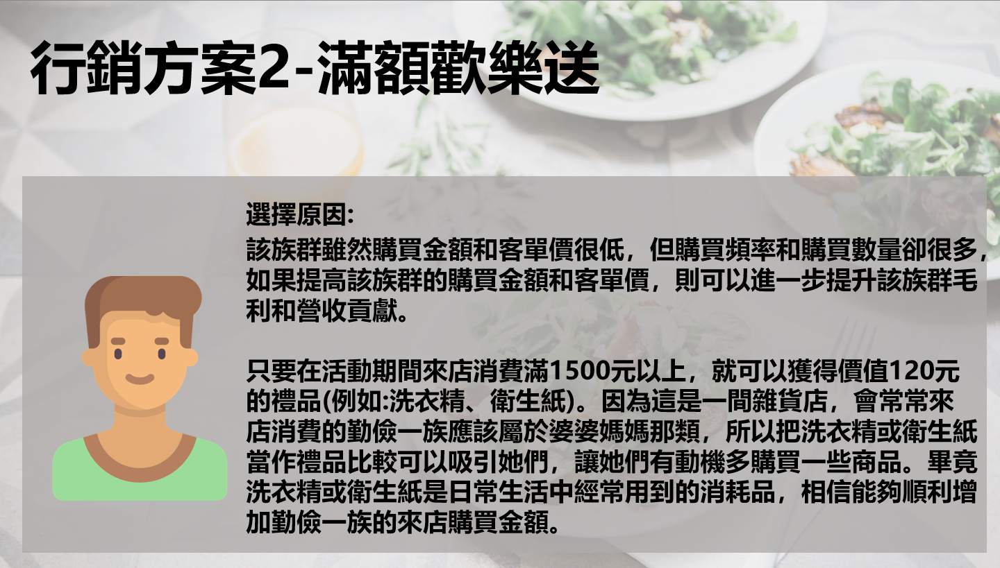

### 前置處理
##### Loading & Preparing Data
```{r echo=T, message=F, cache=F, warning=F}
options(scipen=10)
if(!require(pacman)) install.packages("pacman")
pacman::p_load(latex2exp,Matrix,tidyverse,caTools,manipulate)
rm(list=ls(all=TRUE))
load("data/tf0.rdata");load("data/tf4.rdata")
```

##### 分群資料
```{r}
set.seed(111)
A0$grp = kmeans(scale(A0[,c(2,4,5)]),6)$cluster
table(A0$grp)  # 族群大小
```

##### 分群泡泡圖
```{r}
group_by(A0, grp) %>% summarise(
  recent=mean(r), 
  freq=mean(f), 
  money=mean(m), 
  mcqty = mean(cqty),
  mraw = mean(raw),
  mccost = mean(ccost),
  size=n() ) %>% 
  mutate( revenue = size*money/1000, avgp = size*money/mcqty, gross = mraw*size/1000, avgc = size*mccost/1000)  %>% 
  filter(size > 1) %>% 
  ggplot(aes(x=freq, y=money)) +
  geom_point(aes(size=gross, col=recent),alpha=0.5) +
  scale_size(range=c(4,30)) +
  scale_color_gradient(low="green",high="red") +
  scale_x_log10() + scale_y_log10(limits=c(300,3000)) + 
  geom_text(aes(label = size ),size=3) +
  theme_bw() + guides(size=F) +
  labs(title="Customer Segements",
       subtitle="(bubble_size:Revenue_contribution; text:group_size)",
       color="Recency") +
  xlab("Frequency (log)") + ylab("Average Transaction Amount (log)")
```

##### 購買機率與預期營收的分布
```{r fig.height=2.4, fig.width=7.2}
par(mfrow=c(1,2), cex=0.8)
hist(B$Buy)
hist(log(B$Rev,10))
```

##### 將各群資料合併
```{r}
B = left_join(B, A0[,c(1,13)]) # 將B與A做join，為了grp轉到B
B = B %>% filter(grp != 2) # 排除分群2
B$grp[which(B$grp==6)] <- 2 # 將分群6置換至2
table(B$grp, useNA = "ifany")
```

##### 設定各族群
```{r}
G1 = subset(B, grp=="1") # 流動顧客
G2 = subset(B, grp=="2") # 主力顧客
G3 = subset(B, grp=="3") # 老顧客
G4 = subset(B, grp=="4") # 優質顧客
G5 = subset(B, grp=="5") # 勤儉一族
```

##### 計算各族群特性
```{r}
B %>% 
  group_by(grp) %>% 
  summarise(
    size = n(),
    AvgBuy = mean(Buy),
    AvgRev = mean(Rev),
    TotalRev = sum(Rev),
)
```
### 主力顧客

##### 帶有「參數」的成本效益函數


##### 主力顧客
```{r fig.height=2.2, fig.width=7}
DP = function(x,m0,b0,a0) {m0*plogis((10/a0)*(x-b0))}

par(mar=c(4,4,2,1),mfrow=c(1,2),cex=0.7)
# 用curve指令函數設定m, b, a
curve(DP(x,m=0.25,b=19,a=10), 0, 30, lwd=2, ylim=c(0, 0.25),
      main="F( x | m=0.25, b=19, a=10 )", ylab="delta P")
abline(h=seq(0,0.2,0.05),v=seq(0,30,5),col='lightgrey',lty=2)
m=0.1; b=150; a=200; x=200;gm=0.15*3
dp = DP(x,m,b,a)
#dp = ifelse(B$Buy+dp>1, 1-B$Buy, dp)
eR = gm*dp*B$Buy*B$Rev - x
hist(eR)
```

$$\Delta P = f(x|m,b,a) = m \cdot Logis(\frac{10(x - b)}{a})$$

$$\hat{R}(x) = \left\{\begin{matrix}
\Delta P \cdot M - x & , & P + \Delta P \leq 1\\ 
(1-P) \cdot M - x & , & else 
\end{matrix}\right.$$


##### 參數模擬，需另開.r來模擬
```{r eval=FALSE}
manipulate({##############################
  # 用curve指令函數設定m, b, a
  curve(DP(x,m=0.20,b=15,a=20), 0, 30, lwd=2, ylim=c(0, 0.25),
        main="F( x | m=0.2, b=15, a=20 )", ylab="delta P")
  abline(h=seq(0,0.2,0.05),v=seq(0,30,5),col='lightgrey',lty=2)
},########################################
m = slider(0.05, 0.35,  0.20, step=0.01),
a = slider(  10,   40,    25, step=1),
b = slider(   4,   40,    20, step=1)
)
```

##### 市場模擬：單一參數組合
```{r}
gm = 0.15 * 3
m=0.05; b=50; a=100; X = seq(10,120,1)
sapply(X, function(x) {
  dp = DP(x,m,b,a)
  #dp = ifelse(B$Buy+dp>1, 1-B$Buy, dp)
  eR = gm*dp*B$Buy*B$Rev - x  # 改成回購的機率
  c(x=x, eReturn=sum(eR), N=sum(eR > 0), eReturn2=sum(eR[eR > 0]))
  }) %>% t %>% data.frame %>% 
  gather('key','value',-x) %>% 
  ggplot(aes(x=x, y=value, col=key)) + 
  geom_hline(yintercept=0,linetype='dashed') +
  geom_line(size=1.5,alpha=0.5) + 
  facet_wrap(~key,ncol=1,scales='free_y') + theme_bw()
```

##### 模擬: 不同參數組合(shiny)
> [行銷工具模擬shiny](https://nsysu-kidneyweakx.shinyapps.io/tf_simulation/)

```{r eval=FALSE}
manipulate({####################################
  do.call(rbind, lapply(seq(5,50,0.5), function(x){
    dp = DP(x,m,b,a)
    B %>% mutate(
      #dp = ifelse(Buy+dp>1, 1-Buy, dp),
      eR = gm*dp*B$Buy*B$Rev - x # 行銷工具
    ) %>%
      group_by(grp) %>% summarise(
        Cost = x,
        Group.Sz = n(),
        eR.ALL = sum(eR>0),
        eR.SEL = sum(eR[eR>0]),
      ) } ) ) %>% 
    ggplot(aes(x=Cost, y=eR.SEL, col=factor(grp))) +
    geom_line(size=1.2) +
    ggtitle("Cost Effeciency")
},######################################
m = slider(0.05, 0.25,  0.20, step=0.01),
a = slider(  10,   30,    25, step=1),
b = slider(  10,   50,   20, step=5)
) 
```


##### 市場模擬：不同的族群的比較
```{r fig.height=6, fig.width=6}
X = seq(10, 250, 1) ;mm=0.25 ;bb=19;aa= 10
df = do.call(rbind, lapply(1:5, function(i) {
  sapply(X, function(x) {
    dp = DP(x,mm,bb,aa)
    #dp = ifelse(B$Buy[B$grp==i]+dp>1, 1-B$Buy[B$grp==i], dp)
    eR = gm*dp*B$Buy[B$grp==i]*B$Rev[B$grp==i] - x
    c(i=i, x=x, eR.ALL=sum(eR), N=sum(eR>0), eR.SEL=sum(eR[eR > 0]) )
    }) %>% t %>% data.frame
  })) 

df %>% gather('key','value',-i,-x) %>% 
  mutate(Group = paste0('Grp',i)) %>% 
  ggplot(aes(x=x, y=value, col=Group)) + 
  geom_hline(yintercept=0, linetype='dashed', col='blue') +
  geom_line(size=1.5,alpha=0.5) + 
  xlab('工具選項(成本)') + ylab('預期報償') + 
  ggtitle('行銷工具優化','假設行銷工具的效果是其成本的函數') +
    facet_wrap(~key,ncol=1,scales='free_y') + theme_bw()
```

```{r}
profitRate=gm; Bu=G2$Buy;Re=G2$Rev
m=0.25; a=10; b=19; x = 15
increasingRate = DP(x,m,a,b)
returnTotal = sum(Bu*Re*increasingRate*profitRate-x)
costTotal = length(Bu)*x
data.frame(x=x, increasingRate=increasingRate, returnTotal=returnTotal, costTotal=costTotal, ROI=returnTotal/costTotal)
```

**最佳策略(不能選擇行銷對象)**
```{r}
group_by(df, i) %>% top_n(1,eR.ALL)

```

**最佳策略(可以選擇行銷對象)**
```{r}
group_by(df,i) %>% top_n(1,eR.SEL)
```
---

### 勤儉一族

$$
E(\pi) = g * p * m \\
E(\hat{\pi}) = g * (p+\Delta p) * m(1+\Delta m) \\
E(r) = E(\hat{\pi}) - E(\pi) - x \\ 
\Delta p(x|m_1,b_1,a_1) \; ;\; \Delta m(x|m_2,b_2,a_2)
$$

##### 計算預期營收
```{r fig.height=2.2, fig.width=7}
DP = function(x,m0,b0,a0) {m0*plogis((10/a0)*(x-b0))}

par(mar=c(4,4,2,1),mfrow=c(1,2),cex=0.7)
# 用curve指令函數設定m, b, a
curve(DP(x,m=0.1,b=90,a=100), 50, 200, lwd=2, ylim=c(0, 0.1),
      main="F( x | m=0.25, b=19, a=10 )", ylab="delta P")
abline(h=seq(0,0.2,0.05),v=seq(0,30,5),col='lightgrey',lty=2)

curve(DP(x,m=0.3,b=90,a=100), 50, 200, lwd=2, ylim=c(0, 0.3),
      main="F( x | m=0.25, b=19, a=10 )", ylab="delta m")
abline(h=seq(0,0.2,0.05),v=seq(0,30,5),col='lightgrey',lty=2)
```



> [行銷工具2模擬shiny](https://nsysu-kidneyweakx.shinyapps.io/tf_simulation/#section-2)

##### 市場模擬：不同的參數組合的比較
```{r fig.height=6, fig.width=6}
mm=0.1; bb=90; aa=100     
mm2=0.3 ;bb2=90; aa2=100
X = seq(10, 250, 5) 
df = do.call(rbind, lapply(1:5, function(i) {
  sapply(X, function(x) {
    dp = DP(x,mm,bb,aa)
    dp = ifelse(B$Buy[B$grp==i]+dp>1, 1-B$Buy[B$grp==i], dp)
    dm = DP(x,mm2,bb2,aa2)
    eR = ((B$Buy[B$grp==i]+dp) * B$Rev[B$grp==i]*(1+dm) - B$Rev[B$grp==i]*B$Buy[B$grp==i]) * gm - x

    c(i=i, x=x, eR.ALL=sum(eR), N=sum(eR>0), eR.SEL=sum(eR[eR > 0]) )
    }) %>% t %>% data.frame
  })) 

df %>% gather('key','value',-i,-x) %>% 
  mutate(Group = paste0('Grp',i)) %>% 
  ggplot(aes(x=x, y=value, col=Group)) + 
  geom_hline(yintercept=0, linetype='dashed', col='blue') +
  geom_line(size=1.5,alpha=0.5) + 
  xlab('工具選項(成本)') + ylab('預期報償') + 
  ggtitle('行銷工具優化','假設行銷工具的效果是其成本的函數') +
    facet_wrap(~key,ncol=1,scales='free_y') + theme_bw()
```

**最佳策略(不能選擇行銷對象)**
```{r}
group_by(df, i) %>% top_n(1,eR.ALL)
```

**最佳策略(可以選擇行銷對象)**
```{r}
group_by(df,i) %>% top_n(1,eR.SEL)
```

<p class="qiz">
<span style="font-size:24px">`r "\U1F5FF"` 比較：</span><br>
&emsp; 營收的部分，是主力顧客成長較多，但是報酬率是勤儉一族表現較好 <br>
&emsp;  而獲利增長則是主力顧客較多，兩個方案都各自有比較好的地方 
<br><br><hr>
